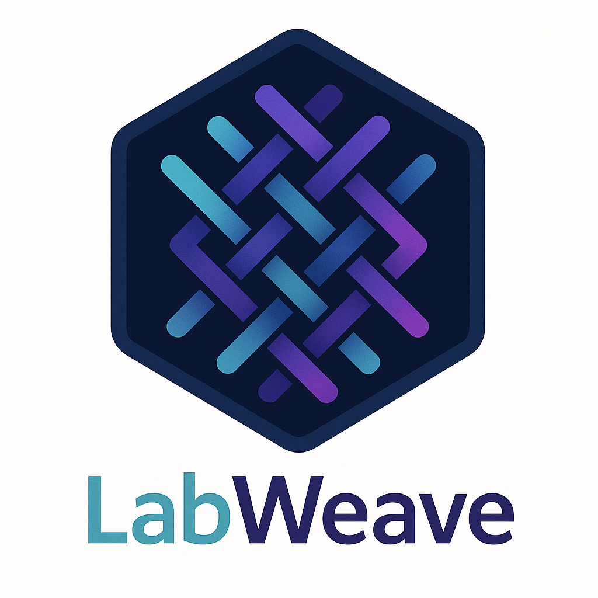

# LabWeave



A comprehensive research operations platform that unifies knowledge management, sample tracking, and AI-driven orchestration for omics research.

## Project Status

🚧 Under active development - MVP in progress

## Overview

LabWeave transforms how scientific research is conducted by:
- Eliminating boundaries between ELNs, LIMS, and analysis tools
- Introducing intelligent research orchestration capabilities
- Focusing on omics research (initially metagenomics)

### Current Focus
- **Domain**: Metagenomics with Illumina sequencing data
- **Scale**: Single lab deployment (8-12 users)
- **Phase**: MVP development focusing on core knowledge management
- **Priority**: Knowledge management → LIMS features → AI capabilities

## Quick Start

### Prerequisites

- Python 3.11.x (Note: Python 3.13 not yet supported due to dependency compatibility)
- Node.js 18+
- Docker & Docker Compose
- Git

### Development Setup

1. Clone the repository
```bash
git clone https://github.com/shandley/labweave.git
cd labweave
```

2. Set up the backend
```bash
cd backend
./setup-dev.sh  # Automated setup script
# OR manually:
python3.11 -m venv venv
source venv/bin/activate  # On Windows: .\venv\Scripts\activate
pip install -r requirements.txt
```

3. Set up the frontend
```bash
cd ../frontend
npm install
```

4. Start infrastructure services
```bash
cd ../infrastructure/docker
docker-compose up -d
```

5. Run database migrations
```bash
cd ../../backend
alembic upgrade head
```

6. Start development servers
```bash
# Terminal 1 - Backend
cd backend
uvicorn src.main:app --reload

# Terminal 2 - Frontend
cd frontend
npm run dev
```

## Architecture

### Technology Stack
- **Backend**: Python 3.11 + FastAPI
- **Databases**: PostgreSQL (primary) + Neo4j (knowledge graph)
- **Frontend**: React 18 with TypeScript
- **AI/ML**: PyTorch + Cloud APIs (OpenAI, Claude, Gemini)
- **Infrastructure**: Docker, Redis, MinIO
- **Testing**: pytest, React Testing Library
- **Code Quality**: Black, Ruff, mypy

### Project Structure
```
labweave/
├── backend/              # FastAPI backend
│   ├── src/             # Source code
│   │   ├── api/         # API endpoints
│   │   ├── models/      # Database models
│   │   ├── schemas/     # Pydantic schemas
│   │   └── core/        # Core utilities
│   ├── tests/           # Backend tests
│   └── alembic/         # Database migrations
├── frontend/            # React frontend
├── infrastructure/      # Docker and configs
└── instructions/        # Project documentation
```

## Documentation

### Core Documentation
- [Project Overview](instructions/labweave-overview.md)
- [Implementation Requirements](instructions/labweave-prompt.md)
- [Technology Stack](instructions/tech-stack.md)
- [MVP Plan](instructions/mvp-plan.md)
- [API Design](instructions/api-design.md)

### Development Guides
- [Development Setup Guide](instructions/development-setup-guide.md)
- [Python Compatibility Analysis](instructions/python-compatibility-analysis.md)
- [Phase 1 Implementation Tracker](instructions/phase1-implementation.md)

### API Documentation
- Available at `/docs` when running the backend server
- OpenAPI specification at `/openapi.json`

## Development

### Running Tests
```bash
# Backend tests
cd backend
pytest
pytest --cov=src  # With coverage

# Frontend tests
cd frontend
npm test
```

### Code Quality
```bash
# Backend
cd backend
black .          # Format code
ruff check .     # Lint
mypy .          # Type checking

# Frontend
cd frontend
npm run lint     # ESLint
npm run format   # Prettier
```

### Common Issues

1. **Python Version**: Ensure you're using Python 3.11.x
   ```bash
   python --version  # Should show 3.11.x
   ```

2. **Database Connection**: Make sure Docker services are running
   ```bash
   docker ps  # Should show postgres, neo4j, redis, minio
   ```

3. **Import Errors**: Always activate the virtual environment
   ```bash
   source backend/venv/bin/activate
   ```

## Features

### Phase 1 (Current)
- ✅ User authentication with JWT
- ✅ Basic project and experiment management
- ✅ Sample tracking for metagenomics
- 🟨 Document management with version control
- 🟨 Knowledge graph for entity relationships

### Phase 2 (Planned)
- ⬜ PubMed integration
- ⬜ Equipment scheduling
- ⬜ Advanced search capabilities
- ⬜ Collaborative features

### Phase 3 (Future)
- ⬜ AI-powered insights
- ⬜ Automated analysis pipelines
- ⬜ Multi-lab federation

## Contributing

This project is in early development. Please contact the maintainers before contributing.

## License

[License pending]